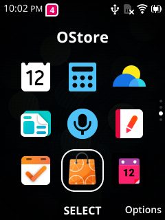
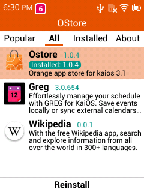
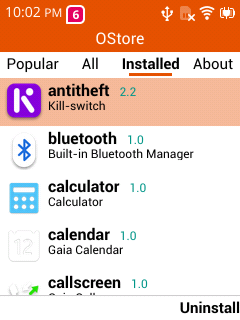
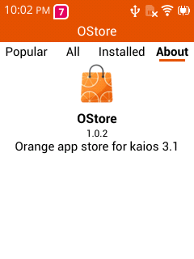

## Nokia 2780 flip jailbreak tutorial

This tutorial can lead you to jailbreak your nokia 2780 flip. Include sideload apps and root.

### Screenshot

Image from this repository contains [ostore](https://github.com/gogogoghost/ostore) to sideload apps. If you uninstalled it. You can do factory reset (format data) or using [appscmd](#sideload-apps-via-cli) to reinstall.







### Prepare

[recovery images](https://github.com/gogogoghost/nokia-2780-flip-jailbreak-tutorial/releases/tag/weeknd-toolbox) (built from [weeknd-toolbox](https://git.abscue.de/affe_null/weeknd-toolbox/))

[boot.img](https://github.com/gogogoghost/nokia-2780-flip-jailbreak-tutorial/releases/tag/patched-files)
Patched boot.img has been replaced the kernel cmdline from **androidboot.selinux=enforcing** to **androidboot.selinux=permissive**

[system.img](https://github.com/gogogoghost/nokia-2780-flip-jailbreak-tutorial/releases/latest)

### Flash them in fastboot mode

Reboot the device and press volume down while booting to enter fastboot.
Then using fastboot cli to flash them.

```bash
# grant permission
fastboot oem sudo

# flash recovery
fastboot flash avb_custom_key pkmd.bin
fastboot flash vbmeta vbmeta.img
fastboot flash recovery lk2nd.img

# flash boot.img
fasboot flash boot boot.img

# flash system.img
fastboot flash system system.img

# format data (first time)
fastboot format userdata
fastboot format cache

# reboot
fastboot reboot
```

Every upgrade you just need to flash the new system.img.

### Adb

Enable "Settings -> Storage -> USB storage". Then your PC can discovery a adb device.

Due to the adbd cannot exchange key. This image contains a pre generated key at **/data/misc/adb/adb_keys**.

You need to use the adb key in this repository to connect to it.

```bash
export export ADB_VENDOR_KEYS=$(REPOSITORY_DIR)/adbkey
adb shell
```

Or you can replace the key by yourself.

System will restore the adb key if **/data/misc/adb/adb_keys** not exist during boot.

### Sideload apps via cli

Image contains [appscmd](https://github.com/gogogoghost/appscmd) to sideload apps.

```bash
adb shell

# install a app
appscmd install /data/local/tmp/application.zip

# install a pwa
appscmd install-pwa https://xxx.com/manifest.webmanifest

# list apps
appscmd list
```

### How to enter recovery

Reboot device and press volume up while booting. You will see the warning screen. Press power key twice can skip it. Or you need to wait for some seconds.

After the warning screen disappear. Press volume up again until the device enter weeknd toolbox.