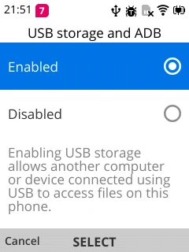
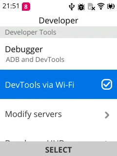
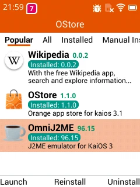

# Nokia 2780 Flip jailbreak tutorial

This repository provides the files and instructions needed to install a patched system image on the Nokia 2780 Flip. The patched image provides recovery, root access, ADB, remote debugging, and application sideloading.

## What the patched image includes

- SELinux runs in permissive mode.
- `su` is available from `adb shell`.
- [OStore](https://github.com/gogogoghost/ostore-solid) is preinstalled for installing and managing KaiOS applications.
- [`appscmd`](#install-apps-from-the-command-line) is included for command-line application installation. This is not the official [KaiOS `appscmd`](https://github.com/kaiostech/appscmd).
- The `USB storage and ADB` switch controls whether ADB is available.
- The hidden **Developer** menu is enabled, including **USB Debugger** and **Remote Debugger**.

## Files to download

Download these files before starting:

- [Recovery images](https://github.com/gogogoghost/nokia-2780-flip-jailbreak-tutorial/releases/tag/weeknd-toolbox), built from [weeknd-toolbox](https://git.abscue.de/affe_null/weeknd-toolbox/)
- [Patched `boot.img`](https://github.com/gogogoghost/nokia-2780-flip-jailbreak-tutorial/releases/tag/patched-files)
- [Patched `system-patched.img`](https://github.com/gogogoghost/nokia-2780-flip-jailbreak-tutorial/releases/latest)

The patched `boot.img` changes the kernel command line from `androidboot.selinux=enforcing` to `androidboot.selinux=permissive`.

## Flash the device

1. Power off the phone, then hold **Volume Down** while turning it on to enter fastboot mode.
2. Connect the phone to the computer and run the following commands from the directory containing the downloaded files:

```bash
# Grant permission.
fastboot oem sudo

# Flash recovery.
fastboot flash avb_custom_key pkmd.bin
fastboot flash vbmeta vbmeta.img
fastboot flash recovery lk2nd.img

# Flash the patched boot and system images.
fastboot flash boot boot.img
fastboot flash system system-patched.img

# Required on the first installation only: erase user data and cache.
fastboot format userdata
fastboot format cache

fastboot reboot
```

For later updates, flashing a new `system-patched.img` is usually sufficient. Formatting `userdata` and `cache` is intended for the first installation.

## Use ADB

On the phone, open **Settings -> Storage -> USB storage and ADB**, then choose **Enabled**. This setting enables both USB storage and ADB; enabling it is the required step for the computer to detect the phone as an ADB device.

<p align="center">
  
</p>

The image restores a pre-generated ADB key to `/data/misc/adb/adb_keys`. Use the key from this repository when connecting:

```bash
export ADB_VENDOR_KEYS="$(pwd)/adbkey"
adb shell
```

Replace `adbkey` with your own key when needed. If `/data/misc/adb/adb_keys` is missing, the image restores it at boot.

## Debug with Firefox

1. On the phone, open **Developer -> Debugger** and enable the debugger.
2. Connect with ADB, then forward the phone's debugger port to the computer:

```bash
adb forward tcp:6200 tcp:6200
```

3. Use Firefox 84 to connect to port `6200` on the computer and debug the device.

<p align="center">
  
</p>

## Install apps

### Use OStore on the phone

OStore is installed with the patched image. Open it from the app list to sideload and manage applications directly on the phone, including [OmniJ2ME](https://j2me.jaxy.cc/).

<p align="center">
  
</p>

### Install apps from the command line

Use the included [`appscmd`](https://github.com/gogogoghost/appscmd) when installing from a computer:

```bash
adb push application.zip /data/local/tmp/
adb shell

# Install an app package.
appscmd install /data/local/tmp/application.zip

# Install a PWA.
appscmd install-pwa https://xxx.com/manifest.webmanifest

# List installed apps.
appscmd list
```

## Enter recovery

1. Reboot the device and hold **Volume Up** while it starts.
2. At the warning screen, press the power button twice to skip it, or wait a few seconds.
3. Press **Volume Up** again until the phone enters weeknd toolbox.

## Known issue

After disabling **USB Debugger** or **Remote Debugger**, the related socket can remain visible, but new connections will fail.
