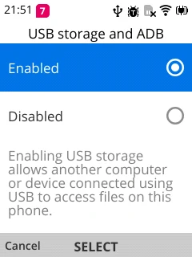
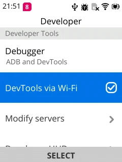
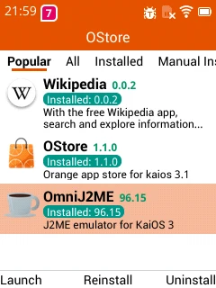

# Nokia 2780 Flip jailbreak tutorial

This repository provides the files and instructions needed to install a patched system image on the Nokia 2780 Flip. The patched image provides recovery, root access, ADB, remote debugging, and application sideloading.

## What the patched image includes

- SELinux runs in permissive mode.
- `adb shell` runs **as root** directly — the image ships a source-built `adbd` that keeps root privileges, so no `su` is needed (the `su` binary is still present for compatibility).
- **No ADB key setup** — the patched `adbd` accepts any key, so connecting is just `adb shell`.
- **ADB over TCP** — set `service.adb.tcp.port` (or `persist.adb.tcp.port`) and restart the ADB switch to use Wi-Fi ADB.
- **Built-in non-core apps are removable** — bundled games and web services can be uninstalled from the launcher.
- [OStore](https://github.com/gogogoghost/ostore-solid) is preinstalled for installing and managing KaiOS applications.
- [appscmd](#install-apps-from-the-command-line) is included for command-line application installation. This is not the official [KaiOS appscmd](https://github.com/kaiostech/appscmd).
- [Sideload](services/Sideload/README.md) is a permission gated app management service: applications holding the `sideload` permission can install, uninstall, list and read installed applications through the api-daemon session. It replaces the unauthenticated `appscmd` HTTP daemon, which is no longer started.
- The `USB storage and ADB` switch controls whether ADB is available.
- The hidden **Developer** menu is enabled, including **USB Debugger** and **Remote Debugger**.

The system image is built by `build.sh`, which prepares the environment (downloads, mount) and then applies every script in `patches/` in numeric order. Each patch script modifies exactly one feature, so individual patches can be reviewed, disabled, or extended easily.

## Files to download

Download these files before starting:

- [Recovery images](https://github.com/gogogoghost/nokia-2780-flip-jailbreak-tutorial/releases/tag/weeknd-toolbox), built from [weeknd-toolbox](https://git.abscue.de/affe_null/weeknd-toolbox/)
- [Patched boot.img](https://github.com/gogogoghost/nokia-2780-flip-jailbreak-tutorial/releases/tag/patched-files)
- [Patched system-patched.img](https://github.com/gogogoghost/nokia-2780-flip-jailbreak-tutorial/releases/latest)

The patched `boot.img` changes the kernel command line from `androidboot.selinux=enforcing` to `androidboot.selinux=permissive`.

## Flash the device

---

# Plesse check your model first !!!

Before the flashing you have to confirm your model is Nokia 2780 Flip. Because there has some models has similar outlook.

Flashing images on other models will brick your device.

- Go to Settings -> Device -> Device Information -> Model. It must be `Nokia 2780`
- Open the device battery compartment and take out the battery. Find Model. It must be `TA-1420`

---

1. Power off the phone, then hold **Volume Down** while turning it on to enter fastboot mode.
2. Connect the phone to the computer and run the following commands from the directory containing the downloaded files:

```bash
# Grant permission.
fastboot oem sudo

# Flash recovery.
fastboot flash avb_custom_key pkmd.bin
fastboot flash vbmeta vbmeta.img
fastboot flash recovery lk2nd.img

# Flash the patched boot and system images.
fastboot flash boot boot.img
fastboot flash system system-patched.img

# Required on the first installation only: erase user data and cache.
fastboot format userdata
fastboot format cache

fastboot reboot
```

For later updates, flashing a new `system-patched.img` is usually sufficient. Formatting `userdata` and `cache` is intended for the first installation.

The api-daemon runs from a copy of the image payload under `/data`, which it rebuilds only when that copy is missing (first boot, after formatting `userdata`) or when the image ships a newer daemon version. After an update that keeps `userdata`, refresh that copy once so the remote services shipped in the new image (Sideload, ...) become available:

```sh
tools/refresh-api-daemon.sh
```

## Use ADB

On the phone, open **Settings -> Storage -> USB storage and ADB**, then choose **Enabled**. This setting enables both USB storage and ADB; enabling it is the required step for the computer to detect the phone as an ADB device.

<p align="center">
  
</p>

The patched image ships a source-built `adbd` that accepts **any** ADB key and runs **as root** directly, so no key setup is needed:

```bash
adb shell
# uid=0(root) — no su, no ADB_VENDOR_KEYS required
```

### ADB over TCP

`adbd` reads the TCP listening port from the `service.adb.tcp.port` property (falling back to `persist.adb.tcp.port`) at startup. To enable Wi-Fi ADB on a port of your choice:

```bash
adb shell
setprop service.adb.tcp.port 5555
# Toggle the switch: Settings -> Storage -> USB storage and ADB -> off -> on
```

The switch restart restarts `adbd`, which then listens on the TCP port in addition to USB. On the computer:

```bash
adb connect 192.168.x.x:5555
adb shell   # still root, no key setup
```

The port persists across reboots only when set via `persist.adb.tcp.port`:

```bash
setprop persist.adb.tcp.port 5555
```

A USB connection is still required for the initial setup, since the ADB switch lives in Settings.

## Debug with Firefox

1. On the phone, open **Developer -> Debugger** and enable the debugger.
2. Connect with ADB, then forward the phone's debugger port to the computer:

```bash
adb forward tcp:6200 tcp:6200
```

3. Use Firefox 84 to connect to port `6200` on the computer and debug the device.

<p align="center">
  
</p>

## Install apps

### Use OStore on the phone

OStore is installed with the patched image. Open it from the app list to sideload and manage applications directly on the phone, including [OmniJ2ME](https://j2me.jaxy.cc/).

OStore uses the [Sideload](services/Sideload/README.md) service when it is available (applications need the `sideload` permission, which the preinstalled OStore declares) and falls back to the legacy `appscmd` HTTP daemon otherwise, so the same build works on systems without the Sideload patch.

<p align="center">
  
</p>

### Install apps from the command line

Use the included [appscmd](https://github.com/gogogoghost/appscmd) when installing from a computer:

```bash
adb push application.zip /data/local/tmp/
adb shell

# Install an app package.
appscmd install /data/local/tmp/application.zip

# Install a PWA.
appscmd install-pwa https://example.com/manifest.webmanifest

# List installed apps.
appscmd list
```

## Enter recovery

1. Reboot the device and hold **Volume Up** while it starts.
2. At the warning screen, press the power button twice to skip it, or wait a few seconds.
3. Press **Volume Up** again until the phone enters weeknd toolbox.

## Uninstall built-in apps

The patched image marks all bundled non-core apps as removable (`maps`, `youtube`, `googlesearch`, `kaios-pay`, `kaios-store`, `kaios-weather`, `kaios-news`, `kaios-todo`, `snake`, `kaios-2048`, `kaios-gems`, `kaios-guardians`, `kaios-birdy`, `kaios-whackamole`). Select an app in the launcher and press the **Options** key to uninstall it.

> **Note:** This only takes effect after a fresh install that clears user data (`fastboot format userdata`). If you flashed over an existing system, update the app database on the computer instead (back up `/data/local/webapps/db/apps.sqlite*` first; `adb shell` is already root):

```bash
adb shell stop api-daemon
adb shell cat /data/local/webapps/db/apps.sqlite > apps.sqlite
adb shell cat /data/local/webapps/db/apps.sqlite-wal > apps.sqlite-wal
adb shell cat /data/local/webapps/db/apps.sqlite-shm > apps.sqlite-shm
sqlite3 apps.sqlite "UPDATE apps SET removable = 1 WHERE name IN ('maps','googlesearch','kaios-news','kaios-pay','kaios-store','kaios-weather','kaios-todo','youtube','kaios-2048','kaios-gems','kaios-guardians','kaios-birdy','kaios-whackamole');"
adb push apps.sqlite /data/local/tmp/
adb shell cp /data/local/tmp/apps.sqlite /data/local/webapps/db/apps.sqlite
adb shell rm -f /data/local/webapps/db/apps.sqlite-wal /data/local/webapps/db/apps.sqlite-shm
adb reboot
```

## Known issue

After disabling **USB Debugger** or **Remote Debugger**, the related socket can remain visible, but new connections will fail.
